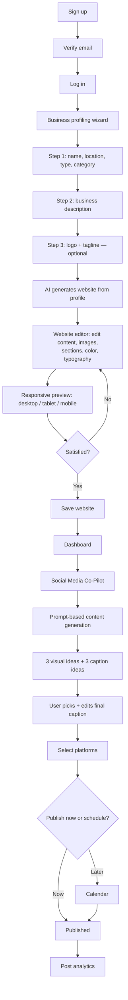

# Business Buddy — Product & Business Strategy

Status: working draft, v1 — written from the current build (landing page + auth scaffold on `feature/landingPage`) and the product walkthrough given 2026-09-16. Nothing here is implemented; this is the reference document engineering, design, and marketing should build against.

---

## 1. Executive summary

Business Buddy takes a small business owner from "I have a business but no online presence" to "my site is live and my social feed runs itself" in one sitting, without them touching a website builder, a design tool, or a scheduling app separately. It's two products that are usually sold by two different companies — an AI website generator and an AI social media manager — fused into one login, one dashboard, one bill.

The wedge isn't "AI website builder" (Wix, Durable, and a dozen others already do that) or "AI social scheduler" (Buffer, Later, Predis do that too). The wedge is that nobody makes you do both in the same place, using the same understanding of your business. Business Buddy asks who you are once, at signup, and reuses that answer everywhere: to write your homepage copy, to suggest your Instagram captions, to pick your brand color. That reuse is the product.

## 2. Business scope

**What Business Buddy is:** a subscription web app for non-technical small business owners that (a) generates and hosts a fully editable business website, and (b) generates, schedules, and analyzes their social media content — sold as one product, one price, one dashboard.

**What Business Buddy is not, on purpose:**
- Not a website builder for developers or agencies who want code-level control (no custom code injection, no headless/API-first story in v1).
- Not an enterprise social suite (no approval workflows, no multi-brand seat management in v1 — see roadmap).
- Not an e-commerce platform first. Selling products is a feature of the website, not the reason the website exists. If the user's core need is a full storefront with inventory, shipping, and tax logic, Shopify still wins that fight; Business Buddy should not pretend otherwise.

**Business model:** SaaS subscription, monthly or annual, tiered by usage (AI generations, storage, platforms connected) rather than by feature-gating core functionality. Section 11 covers this in depth, including a recommended change from the current three tiers.

**Where the business physically starts:** Pakistan (the founding market, and a market most Western competitors under-serve — see Section 9), expanding to a global self-serve audience from day one because the internet doesn't check passports and the pricing/packaging in Section 11 is built to flex by region from the start.

## 3. Core audience

The product must read as credible to a home baker in Lahore and a landscaping contractor in Ohio at the same time. That's a real constraint, not a slogan — it shapes copy, imagery, currency handling, and support hours.

### 3.1 Primary segment: the solo or 2–5 person operator

The person who *is* the business. They do the work, the books, and (badly, resentfully, or not at all) the marketing. They are not going to learn Figma, Webflow, or Canva properly. They will try a tool for ten minutes and leave if it asks them to make a decision they don't have an opinion on (a font pairing, a grid layout, a color wheel).

Representative personas, deliberately spread across geography and business type so the product isn't accidentally designed for one of them:

| Persona | Location | Business | Sharpest pain today |
|---|---|---|---|
| Ayesha | Lahore, Pakistan | Home bakery, orders via WhatsApp | Has no website at all; Instagram is the whole business; can't take her mother's-recipe brand seriously without something to point customers to |
| Marcus | Columbus, Ohio, USA | Landscaping & lawn care | Has an outdated Wix site from 2019 nobody updates; posts to Facebook maybe once a month, inconsistently |
| Fatima | Dubai, UAE | Handmade abaya / modest fashion boutique | Sells through Instagram DMs; wants a real storefront but every builder she's tried demands design decisions she doesn't want to make |
| Priya | Bengaluru, India | Freelance henna & event decor artist | One-person brand; needs to look bigger than she is to book corporate events; no budget for a designer |
| Tunde | Lagos, Nigeria | Sneaker resale / streetwear | Mobile-only, prepaid data — every screen has to work well on a mid-range Android on a slow connection |
| Sarah | Manchester, UK | Independent pet groomer | Time-poor, not tech-poor; will pay for anything that gives back an hour a week |

The common thread isn't nationality or income bracket — it's **time and confidence**, not money or intelligence. They're competent business operators who have decided, correctly, that becoming amateur web designers and amateur social media managers is not the best use of their remaining hours in the day.

### 3.2 Secondary segment (later, not v1): the multi-client operator

Freelance marketers, small agencies, and VAs who run websites and social calendars for 3–15 small-business clients. They want everything the primary segment wants, multiplied, plus client switching and (eventually) white-label. Section 8 (roadmap) covers this; it should not distort v1 design decisions.

### 3.3 Explicit non-targets

- Enterprises and franchises needing multi-approval publishing workflows.
- Businesses whose core need is inventory-heavy e-commerce (dropshipping at scale, multi-warehouse retail).
- Developers who want to eject the generated site into their own codebase. (A later "export" feature is a reasonable retention lever, not a v1 promise.)

### 3.4 What "international, not just Pakistani" means in practice

It means, concretely, from v1:
- All copy is written in plain, idiom-light English that translates cleanly, not region-specific slang.
- Pricing displays in local currency with region-aware price points (Section 11.5) — a flat USD price is a Silicon-Valley-default mistake for a product whose stated first market is Pakistan.
- Templates and stock imagery in onboarding must not default to one region's aesthetic (no "coffee shop in Brooklyn" bias) — the AI generation step should reflect the business category and description the user gives, not a Western-default template library.
- Payment methods need to cover both international cards (Stripe) and locally dominant rails where the card networks are weak (JazzCash / Easypaisa in Pakistan, for instance). This is a Section 8 roadmap item, not a v1 blocker, but pricing and packaging should be designed knowing it's coming.

## 4. The user journey (as specified, formalized)

Dashboard sections, as specified: **Overview/analytics, Settings, Web Template, Social Media, Calendar, Website Analytics.** Section 6.3 below expands each.

Two structural notes worth flagging before anything gets built:

1. **The onboarding wizard is the single highest-leverage screen in the product.** It's the only data the AI has to write the entire website and set the tone for every social post afterward. Three steps is the right length (don't add a fourth "just in case" step), but Step 2 ("business description") needs a genuinely good empty-state prompt or example text, because a blank textarea is where most onboarding flows quietly lose people who don't know what to write.
2. **"Optional" logo and tagline in Step 3 need a real fallback, not a placeholder.** If a user skips the logo, Business Buddy should generate a simple wordmark from their business name (same design logic used for our own identity, Section 7) rather than leaving a broken image slot or a generic globe icon on their new site.

## 5. Onboarding data model (what Step 1–3 actually needs to capture)

To avoid this being re-litigated at implementation time, the minimum fields the wizard should capture:

- **Step 1 — Identity & category:** business name, location (city + country, for currency/timezone/local-flavor defaults), business type (product / service / hybrid), business category (from a fixed taxonomy — food & beverage, retail/fashion, beauty & wellness, home services, professional services, events, creative/artist, other).
- **Step 2 — Description:** free text, business description (what you sell, who it's for, what makes it different — give the user these three prompts inline rather than one blank box).
- **Step 3 — Optional branding:** logo upload, tagline. If skipped: auto-generate a wordmark; leave tagline blank rather than inventing one the owner didn't approve (a wrong tagline on a small business's first-ever site is a trust hit).

This data model is also what should get reused by the Social Media Co-Pilot later (Section 6.4) — the business description and category should silently inform caption tone without the user re-explaining their business every time they write a post prompt.

## 6. Core features (v1)

### 6.1 Business profiling (onboarding wizard)
Covered in Sections 4–5.

### 6.2 AI Website Generator + Editor
- Generates a first draft site from the onboarding profile: header/nav, hero, about, products/services, gallery or carousel, testimonials (real, empty by default — never seeded with fake reviews, see Section 12), footer.
- Wix-style direct-manipulation editor: click any element to edit text/images in place; add, remove, or reorder sections; drag to rearrange.
- Global style controls: color palette (derived from the generated brand color, user can override), font pairing, spacing/density presets — a *curated* set of good combinations, not a raw color wheel and font list. Small business owners do not want infinite choice; they want a handful of choices that are all good.
- Responsive preview toggle: desktop / tablet / mobile, before publish.
- Save → publish flow, with a generated subdomain (`ayeshasbakery.businessbuddy.site` or similar) and custom domain connection as a paid-tier feature (Section 11).

### 6.3 Dashboard
- **Overview:** the one page that answers "is my business doing okay online right now" at a glance — site visits this week, posts published, next scheduled post, one or two headline social metrics. Not a data-dense analytics console; a status check.
- **Settings:** account, business profile (the same fields from onboarding, editable), billing/plan, connected social accounts, team members (roadmap).
- **Web Template:** re-enter the website editor from Section 6.2.
- **Social Media:** the Co-Pilot itself (Section 6.4).
- **Calendar:** every scheduled and published post, by date, across all connected platforms — the single source of truth for "what's going out and when."
- **Website Analytics:** traffic, top pages, referral sources — separated from social analytics because website and social answer different owner questions ("is my site working" vs. "is my content working").

### 6.4 Social Media Co-Pilot
- Prompt-based generation: user describes what they want ("promote our weekend sale," "new product photo for the blue scarf"), optionally uploads an existing image to redesign or extend rather than generate from nothing.
- Output: **3 distinct visual/design directions** and **3 caption directions**, mixed and matched by the user rather than locked as three fixed pairs — a user should be able to take design idea 2 with caption idea 1.
- Final caption is user-editable before anything goes out; the AI drafts, the owner has the last word, always. This is a trust requirement, not a nice-to-have — a business's public voice is the one thing they will not delegate blindly.
- Platform selection (multi-select) at publish time, not earlier — the same core content can fan out to Instagram, Facebook, TikTok, etc. with platform-appropriate formatting.
- Publish now or schedule for later; scheduled posts land on the Calendar (6.3).
- Post-level analytics once published (reach, engagement — exact metric set depends on what each platform's API actually exposes, which varies by platform and should not be over-promised in marketing copy).

## 7. Product design identity

### 7.1 Visual identity
- **Mark:** the Duo Mark — two equal rounded squares overlapping on a diagonal, approved 2026-09-16 (`components/Logo.tsx`). One shape, one idea: two things (site + social, owner + Buddy) run as one. It's deliberately not a mascot, not a literal "buddy" illustration — the personality lives in the product's voice and copy, not in a cartoon character that ages badly.
- **Color:** brand primary `#ee64ff` (magenta/orchid, `oklch(0.733 0.245 323)`), paired with black foreground per the existing design tokens in `app/globals.css`. This is a confident, warm, slightly unexpected choice for a small-business SaaS category that defaults to blue (Wix, Squarespace, Shopify, LinkedIn-adjacent everything) — worth protecting rather than diluting with a "safer" blue as the product matures.
- **Typography:** Inter for interface and running text, with the existing display faces (Anzo, Blinds Audience) reserved for single emphasized words in headlines, per the current `app/layout.tsx` setup. Keep that restraint — display faces used for full sentences stop looking intentional and start looking like a font demo.

### 7.2 Voice and tone
Business Buddy talks like a competent friend who happens to be good at this, not like enterprise software and not like a mascot. Concretely:
- Say "your site," "your feed," "your customers" — second person, always theirs, never "the platform's."
- Prefer plain verbs over software verbs: "we'll write it," "pick a time," "see what's next" — not "leverage," "optimize," "unlock," "seamlessly."
- Confidence without hype: "your site, live today" beats "revolutionize your online presence."
- Never blame the user for not knowing something technical. If a step needs jargon (domain, DNS, subdomain), explain it in one clause inline rather than assuming or shaming.

### 7.3 Product-level design principles
- **A handful of good choices beats infinite choice.** Every place the product could offer a free-form control (colors, fonts, layouts), prefer a curated set first, with "more options" tucked behind a secondary action for the minority who want it.
- **Celebrate the milestones that matter to the owner, not to us.** First site published, first post scheduled, first 100 site visits — these deserve a genuine, brief moment (not a confetti animation for every button click, which trains users to ignore all of them).
- **Never show an empty state without a next action.** An empty calendar, an empty analytics chart, a freshly generated site with a blank testimonials section — each needs a one-line "here's what to do about that," not silence.

## 8. Future feature roadmap

Ordered by sequencing logic (what unlocks revenue or retention next), not by difficulty.

**Near-term (v1.5, first 2–3 quarters post-launch)**
- Local payment rails for Pakistan (JazzCash, Easypaisa) alongside Stripe, so the founding market can actually pay in a way it prefers.
- WhatsApp Business integration — for the Pakistani, Gulf, and South Asian segments especially, WhatsApp is where the actual customer conversation happens after a social post or site visit; connecting it to the Co-Pilot (auto-reply drafts, click-to-WhatsApp buttons on the generated site) is high-leverage for the founding market specifically.
- Regional/PPP-adjusted pricing display (Section 11.5).
- Basic SEO assistance on the generated site (meta descriptions, alt text, sitemap) — table stakes against Wix/Squarespace, currently unaddressed.
- Review management (surfacing and responding to Google/Facebook reviews from the dashboard) — closes the loop that testimonials on the generated site should showcase real, current feedback rather than staying empty forever.

**Mid-term (v2)**
- Multi-language site + caption generation (not just translation — locale-appropriate tone, since a direct translation of an English caption reads oddly in most languages).
- E-commerce depth for the segment that needs it: simple product catalog, checkout, and order notifications — enough to sell without becoming Shopify.
- Team seats / multi-user access to one business account (a shop with two owners, or an owner plus one employee who posts).
- Brand memory / style consistency engine: the AI remembers a business's established voice and visual style across sessions instead of treating every generation prompt as a cold start.
- Instagram/TikTok Shop and marketplace integrations.

**Long-term (v3+)**
- Agency mode: one login managing multiple client businesses, with white-label options — this is where Section 3.2's secondary segment gets served properly, once v1 is solid enough to not dilute focus.
- Native mobile app (post scheduling and approval on the go is the single most-requested feature in this category historically — Buffer, Later, and Hootsuite all built mobile early for exactly this reason).
- Marketing automation beyond social: email capture on the generated site, basic email campaigns to the list it captures.
- Public API / site export for the power users who eventually outgrow the no-code ceiling — a retention feature, framed as "you don't have to leave," not a cannibalization risk if positioned as an upsell rather than a free exit door.

## 9. Competitor analysis

No single company competes with Business Buddy directly today — that gap is the opportunity, and also the risk (it means "why not just use two tools" is the real objection to overcome, not "why not use competitor X"). Two competitive fronts:

### 9.1 Website builders

| Competitor | Category | Strength | Weakness (for this audience) | Approx. price/mo* |
|---|---|---|---|---|
| Wix | General website builder + AI (ADI) | Huge template library, mature ecosystem, App Market | Overwhelming for a first-time user; AI builder still hands you a generic template to then manually rework | $17–$59 |
| Squarespace | Design-forward website builder | Best-in-class visual polish out of the box | Design polish requires more manual tuning than this audience has patience for; no meaningful social layer | $16–$49 |
| Durable | AI website builder, "site in 30 seconds" | Fastest generation in the category, genuinely simple | Website-only — no social layer at all; shallow customization once generated | $12–$20 |
| 10Web | AI WordPress site builder | Real WordPress under the hood (portable, SEO-capable) | WordPress's complexity leaks through for non-technical users; no social layer | $10–$42 |
| Shopify | E-commerce platform | The default for serious online selling | Overkill and over-priced for a business that isn't primarily a storefront; steep learning curve | $29–$299 |

### 9.2 Social media management tools

| Competitor | Category | Strength | Weakness (for this audience) | Approx. price/mo* |
|---|---|---|---|---|
| Buffer | Scheduling + light AI assist | Simple, well-loved UI, real free tier | Content generation is shallow compared to a purpose-built AI copilot; no website | $6–$120 |
| Later | Visual scheduling, strong for Instagram | Great content calendar UX | Skews toward larger creators/brands; no website | $18–$80 |
| Hootsuite | Enterprise-grade social suite | Handles many brands/approval workflows | Priced and built for teams, not solo owners; steep for this audience | $99–$249 |
| Predis.ai | AI content + design generation, scheduling | Closest existing analog to the Co-Pilot idea | Social-only, no website; still feels like a "tool," not a business partner | $29–$59 |
| Ocoya | AI copy + design + scheduling | Similar bundle to Predis | Same gap — no website side; smaller ecosystem/support | $15–$100 |
| Canva (+ its scheduling) | Design tool, freemium | Everyone already knows it, genuinely good design output | Not purpose-built for scheduling/analytics; no website; requires the user to still "design," just with better tools | Free–$13 |

\* *Public list prices as of early 2026, illustrative — these move often and should be re-verified before being used in comparison marketing.*

### 9.3 The actual competitive statement

The honest competitor isn't a company, it's a **stack**: Wix (or Canva templates) + Instagram/Facebook native scheduling + ChatGPT for captions + a notes app functioning as a content calendar. That stack is free-to-cheap, which means Business Buddy's real pitch isn't "we're better than Wix" — it's "we're the one thing instead of four things, and the four things don't talk to each other." A user's website not knowing what their Instagram looks like (and vice versa) is the actual, felt pain this product removes.

## 10. USP, told as a story

Ayesha has been running a home bakery out of her kitchen in Lahore for two years. Every order comes through WhatsApp, every customer finds her through an Instagram post her cousin helped her make once, eighteen months ago. She knows she's leaving money on the table — people ask "do you have a menu?" and she screenshots a price list from her Notes app. She has tried, twice, to build a website. Both times she opened a builder, stared at a blank template asking her to pick a font, and closed the tab within ten minutes. Not because she isn't capable — she runs a business — but because font-pairing isn't the business she's in, and the tool made her do it before it would give her anything back.

Business Buddy asks Ayesha three short questions instead of handing her a blank canvas. It already knows she's a home bakery in Lahore before it generates a single word of copy, so the website it drafts sounds like a bakery, not a generic "welcome to our business" template. When she publishes it, the same profile is sitting there for her next social post — she doesn't re-explain her business to a second tool. She types "new eid cookies, want to promote this weekend," and gets three photo directions and three captions back that already sound like her, because the product has been carrying that context since the day she signed up.

That's the USP, and it isn't "AI website builder" or "AI social media tool" — plenty of things claim both of those. It's that **the business only has to introduce itself once**, and every surface of the product — the site, the caption, the color on the button — draws from that same understanding instead of starting cold. Competitors sell tools. Business Buddy sells the fact that its tools already know you.

## 11. Pricing strategy

### 11.1 Current pricing (landing page, as of this writing)

| Tier | Price | Positioned for |
|---|---|---|
| Starter | $9.99/mo | First site + basic scheduling |
| Pro (featured) | $29.99/mo | Daily posters |
| Business | $49.99/mo | Multiple brands, one dashboard |

### 11.2 A bug to fix before anything else

The **Business tier's feature list on the current landing page (`components/landingPage/constants.ts`) is a literal copy-paste duplicate of the Starter tier's list, repeated twice.** A $49.99/mo plan whose feature list is identical to (and shorter in substance than) a $29.99/mo plan, just listed twice, actively damages trust in the pricing table the moment a careful buyer compares tiers line by line — and business buyers comparing a $50/mo recurring cost are exactly the careful-reading type. This needs real, differentiated Business-tier features before launch, independent of any pricing model change below.

### 11.3 Where the current model is a cost risk

"Unlimited social media scheduling" is fine — scheduling is cheap (it's just a timed API call). **"Post and Caption Generation" with no stated cap, starting at the Pro tier, is the actual cost risk** — each generation round is 3 image directions + 3 captions, meaning up to 6 model calls (more if images are generated rather than edited) per single user request, and image generation/editing costs meaningfully more per call than text. An engaged Pro user generating content daily could cost more in inference than the plan collects, especially before volume pricing kicks in on the AI provider side. This needs a stated usage allowance (e.g., "150 AI generations/month" on Pro, with clearly priced top-up packs), not an unlimited promise, before this becomes a real financial exposure rather than a hypothetical one.

### 11.4 Two gaps against the market

- **No free tier or trial.** Every direct-analog competitor in Section 9 offers either a real free plan (Buffer, Canva, Wix has a free/very-cheap entry point) or a free trial. For a product whose core value (AI writes it for you) can't be evaluated from a screenshot, a paywall before first use is a meaningful conversion tax. A limited free tier (capped AI generations, Business Buddy subdomain + light branding, one connected platform) also does double duty as a distribution channel in price-sensitive markets — every published free-tier site is a small advertisement for the product.
- **No custom domain story.** None of the three current tiers mention a custom domain, which every competitor in Section 9.1 treats as a baseline expectation once someone is paying. This needs to be explicit — free/subdomain on entry, custom domain from a specific paid tier up.

### 11.5 Recommended pricing structure (v2)

| Tier | Price (indicative, USD) | Website | Social/AI | Notes |
|---|---|---|---|---|
| **Free** | $0 | 1 site, Business Buddy subdomain, light "Made with Business Buddy" credit | 10 AI generations/mo, 1 platform connected, manual publish only | Distribution + trial-of-value tier; watermark and subdomain are the upgrade incentive, not a locked-out core feature |
| **Starter** | $12–15/mo | Custom domain support, remove branding, 5GB storage | 50 AI generations/mo, up to 3 platforms, scheduling + calendar | The "I'm serious now" tier — priced to still feel like an easy yes |
| **Pro** *(most popular)* | $29–35/mo | Advanced site customization, 25GB storage, basic SEO tools | 200 AI generations/mo (overage packs available), all supported platforms, full analytics | Where most paying solo owners should land |
| **Business** | $69–79/mo | Multiple sites/brands under one login, priority support, unlimited storage | Higher/soft-capped AI allowance with fair-use overage pricing, team seat(s) | Must have features genuinely beyond Pro — see 11.2 — likely early home for the agency segment (Section 3.2) until a dedicated Agency plan exists |

Annual billing at roughly 20% off monthly across all paid tiers is standard in this category and should be included from launch, not bolted on later — it's a retention and cash-flow lever, not a pricing philosophy change.

**Region-aware pricing** (PPP-style adjustment, the way Spotify, Netflix, and Notion price for Pakistan/India/Nigeria differently than the US/UK/Gulf) is strongly recommended given the stated audience spans both a price-sensitive founding market and a full-price international one. This can launch as a v1.5 item (Section 8) rather than blocking v1, but the pricing page's architecture (region field already exists from onboarding location data, Section 5) should be built to support it from the start rather than retrofitted.

## 12. Landing page content issues found during this review

Not code-fixed here per instruction — flagged for a follow-up pass:

1. **The "Seamless Scheduling on your social media" section's image doesn't depict the actual product** — it should show something recognizable as the Co-Pilot flow (prompt → 3 ideas → calendar), not a generic/unrelated visual, or it undersells the feature that's arguably the product's second pillar.
2. **The "What our users say?!" testimonials section is entirely placeholder data** (`components/landingPage/constants.ts` — nine fabricated names, quotes, and avatar images). Shipping fabricated testimonials to production is a credibility and, in some jurisdictions, a legal/advertising-standards risk once the site is live and being judged as a real product. Recommend hiding this section entirely until real customer testimonials exist, rather than launching with invented ones.

## 13. Open questions / risks worth deciding early

- **AI cost ceiling per tier** needs real numbers from whichever model provider(s) get chosen before Section 11.5's generation caps are finalized — the figures above are structurally right but numerically illustrative.
- **Which social platforms ship in v1** (Instagram + Facebook are the obvious floor; TikTok and WhatsApp both matter to different segments in Section 3 and should be sequenced deliberately, not "all platforms at once").
- **Domain/hosting cost model** for the free tier at scale — free subdomains are cheap; if custom domains get cheap enough to include lower in the pricing ladder than recommended above, that's a lever worth re-testing.
- **Legal/compliance for scheduled publishing** across regions (data residency questions may eventually differ for EU users vs. Pakistani users) — not a v1 blocker, worth a note for whoever owns compliance later.
